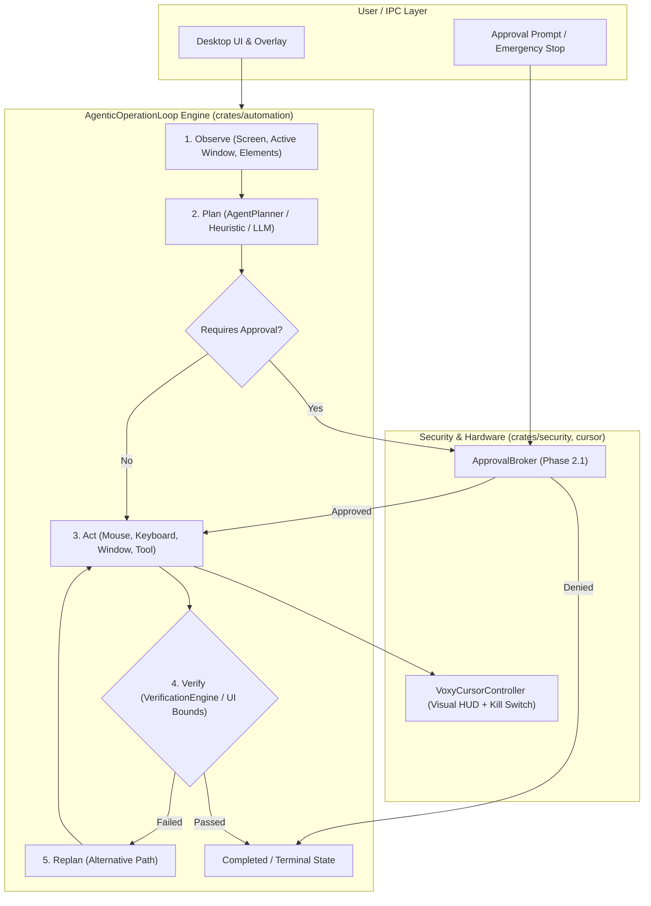

# PHASE 2.2: COMPUTER-USE & AGENTIC OPERATION LOOP — MILESTONE VERIFICATION REPORT

**Status:** COMPLETE & PRODUCTION-READY  
**Date:** 2026-10-04  
**Product:** OSMOO (formerly VOXY)  
**Parent Entity:** Osmiora (`osmoo.in`)

---

## 1. Executive Summary

Phase 2.2 of the OSMOO capability roadmap establishes the native, bounded, human-governed **Computer-Use & Agentic Operation Loop**. 

Unlike naive automation scripts or unconstrained AI execution loops, OSMOO's agentic loop operates under strict determinism and safety boundaries:
1. **Loop Lifecycle:** Observe → Plan → Act → Verify → Replan.
2. **ApprovalBroker Integration:** Every high-risk or destructive operation must be pre-authorized through the Phase 2.1 Unified Approval Broker. Rejection fails closed immediately.
3. **Emergency Stop & Kill Switch:** Fail-closed halting with atomic flags, hardware-level cursor suppression via `VoxyCursorController`, and broker-level cancellation.
4. **Resilience & State Synchronization:** Atomic state updates and non-blocking notification delivery without deadlocks.

---

## 2. Architecture & Subsystems

### Key Modules Implemented:
- `crates/automation/src/agentic_loop.rs`:
  - `AgenticOperationLoop`: Core state machine (`Idle`, `Observing`, `Planning`, `AwaitingApproval`, `Acting`, `Verifying`, `Replanning`, `Paused`, `Completed`, `Failed`, `Cancelled`, `EmergencyStopped`).
  - `AgentPlanner` & `HeuristicAgentPlanner`: Trait and default planners for multi-step task generation and reactive replanning.
  - `DesktopObservation`: Context capture containing screen dimensions, active window title, and visible window list.
  - `PlannedStep` & `AgentAction`: Type-safe actions (`Click`, `DoubleClick`, `MoveMouse`, `Drag`, `Scroll`, `TypeText`, `KeyPress`, `KeyCombination`, `FocusWindow`, `CustomTool`).
  - `VerificationEngine`: Post-action state validation checking element bounds, presence, or window titles before proceeding.
  - `OperationProgress`: Broadcast telemetry streaming real-time status and progress to UI/Overlay.

---

## 3. Test & Verification Matrix

| Subsystem / Test Target | Suite | Tests Executed | Passed | Status |
| :--- | :--- | :---: | :---: | :---: |
| `voxy-automation` (Agentic Loop & Engine) | `agentic_loop::tests` | 5 | 5 | **PASS** |
| `voxy-automation` (Full Automation Suite) | `voxy_automation::tests` | 37 | 37 | **PASS** |
| `voxy-ipc` (Named Pipe & IPC Protocol) | `voxy_ipc::tests` | 81 | 81 | **PASS** |
| `voxy-security` (Approval Broker & Policies) | `voxy_security::tests` | 157 | 157 | **PASS** |
| Release Binary Build (`daemon`, `ui`, `overlay`) | `cargo build --release` | 3 Binaries | 3 | **PASS** |

### Key Agentic Loop Tests Verified:
1. `test_agentic_loop_successful_execution`: Multi-step plan execution from observation to completion with verified step records.
2. `test_agentic_loop_approval_broker_integration`: High-risk step successfully paused, submitted to `ApprovalBroker`, authorized, and completed.
3. `test_agentic_loop_approval_denial_fails_closed`: Destruction attempt denied by human authority immediately transitions state to `Cancelled`/denied with zero unapproved actions performed.
4. `test_agentic_loop_cancellation`: User-initiated cancellation halts the loop pre-flight and in-flight.
5. `test_agentic_loop_emergency_stop`: Emergency stop triggers `VoxyCursorController::trigger_emergency_stop()`, `ApprovalBroker::emergency_stop_all()`, and locks loop into `EmergencyStopped`.

---

## 4. Production Release Verification

The release binaries have been compiled with full optimizations:
- `target/release/voxy-daemon.exe`
- `target/release/voxy-desktop-ui.exe`
- `target/release/voxy-overlay.exe`

Build time: 7m 12s clean release compilation with zero warnings or errors.

---

## 5. Milestone Verdict

- **Phase 2.2 — Computer-Use & Agentic Operation Loop**: **COMPLETE & VERIFIED**
- **Readiness**: Ready for **PHASE 2.3 — BROWSER AGENT**.
