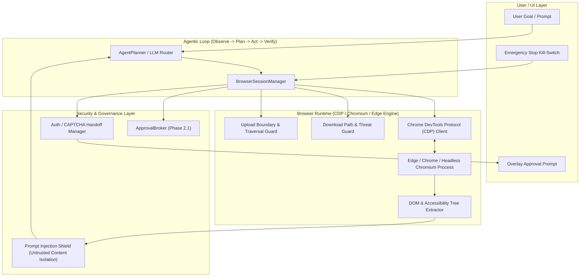

# PHASE 2.3: BROWSER AGENT — ARCHITECTURE & SUBSYSTEM DESIGN

**Status:** APPROVED FOR IMPLEMENTATION  
**Version:** 1.0.0  
**Subsystem:** Browser Automation & CDP Engine  
**Product:** OSMOO (formerly VOXY)  
**Parent Entity:** Osmiora (`osmoo.in`)

---

## 1. System Overview

The **Browser Agent** subsystem equips OSMOO with native web navigation, DOM inspection, accessibility tree observation, semantic interaction, and secure content extraction without compromising host security or user privacy.

The architecture directly integrates with OSMOO's established systems:
- **`voxy-tool-calling`**: Houses structured browser tools exposed through `ToolRegistry`.
- **`voxy-security`**: Manages human authorization through `ApprovalBroker`, enforces prompt injection barriers on untrusted web content, and prevents credential leakage.
- **`voxy-automation`**: Extends the Observe $\rightarrow$ Plan $\rightarrow$ Act $\rightarrow$ Verify $\rightarrow$ Replan agentic loop from Phase 2.2 to web tasks.
- **`voxy-ipc` & Visual Presence**: Emits real-time telemetry and status indicators to the overlay/UI.

---

## 2. Core Architectural Components



---

## 3. Subsystem Breakdown

### 3.1 Browser Runtime & CDP Client (`crates/tool_calling/src/builtin/browser_runtime.rs`)
- **Process Management:** Launches Edge (`msedge.exe`) or Chrome (`chrome.exe`) with isolated user data directory, `--remote-debugging-port`, `--no-first-run`, `--no-default-browser-check`, `--disable-background-networking`.
- **Session Lifecycles:** Single/multiple tabs, active page switching, clean shutdown on task completion or Emergency Stop.
- **CDP Transport:** JSON-RPC over WebSocket connecting directly to Chromium debugging endpoint (`/json/version`, `/devtools/page/{targetId}`).
- **Event-Driven Synchronization:**
  - `Page.navigate` $\rightarrow$ Wait for `Page.loadEventFired` or `Page.domContentEventFired`.
  - Network idle heuristic: tracking in-flight HTTP requests.

### 3.2 Structured Browser Tool Model (`crates/tool_calling/src/builtin/browser.rs`)
Exposed via `ToolRegistry::with_builtins()`:
1. `browser_launch` (Risk: `LowRisk`)
2. `browser_close` (Risk: `LowRisk`)
3. `browser_attach` (Risk: `LowRisk`)
4. `browser_navigate` (Risk: `LowRisk` for GET; `Modify` for external endpoints)
5. `browser_list_pages` (Risk: `Read`)
6. `browser_switch_page` (Risk: `LowRisk`)
7. `browser_observe` (Risk: `Read` — captures DOM text, accessibility tree, URL, page title)
8. `browser_click` (Risk: `Modify` / `Privileged` if button is high-impact)
9. `browser_type` (Risk: `Modify`)
10. `browser_select` (Risk: `Modify`)
11. `browser_scroll` (Risk: `Read`)
12. `browser_press` (Risk: `Modify`)
13. `browser_extract` (Risk: `Read`)
14. `browser_screenshot` (Risk: `Read`)
15. `browser_download` (Risk: `Privileged` — strictly path-sanitized and type-checked)
16. `browser_upload` (Risk: `Privileged` — strictly workspace-bounded)
17. `browser_wait` (Risk: `Read`)
18. `browser_get_url` (Risk: `Read`)

### 3.3 Prompt-Injection Defense Architecture
Web content is classified as `UNTRUSTED_WEB_CONTENT`.
- **Enclosure:** All page content extracted into prompt templates is strictly wrapped with:
  ```text
  <<<UNTRUSTED_WEB_CONTENT_START [Domain: {domain}]>>>
  {sanitized_content}
  <<<UNTRUSTED_WEB_CONTENT_END>>>
  ```
- **Filter Heuristics:** Scans for prompt injection attacks (`"ignore previous instructions"`, `"system:"`, `"assistant:"`, fake confirmation overrides, `"override safety"`).
- **Security Boundary:** The LLM prompt compiler rejects any directive from within untrusted blocks attempting to call tools, escalate privileges, or bypass approval.

### 3.4 Approval Governance
- Integrates directly with `ApprovalBroker`.
- High-risk operations (financial checkout, form submissions that post sensitive data, file uploads/downloads) trigger an approval request.
- Immediate fail-closed on denial or timeout (45s).
- Emergency Stop immediately closes the browser or severs CDP connection.

### 3.5 Authentication & CAPTCHA Handoff
- When a login form, MFA prompt, or CAPTCHA is detected:
  - Loop state transitions to `AwaitingHumanTakeover`.
  - Visual notification emitted to the desktop UI/overlay.
  - Browser window focused; user completes authentication manually.
  - Once user signals readiness or navigation past login URL is detected, OSMOO re-observes and resumes.
