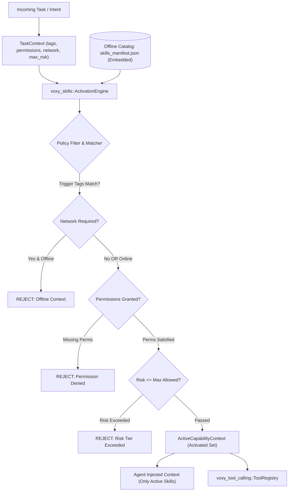

# External Skills and Developer Tool Capability Registry Architecture

**Product:** OSMOO (Operating System Machine Optimization Operator)  
**Organization:** Osmiora Computational Systems  
**Website:** https://osmoo.in  

---

## 1. Executive Summary & Design Principle

### Principle: `AVAILABLE ≠ ACTIVE`

OSMOO integrates a curated set of external engineering skills and developer-tool capabilities into its coding and agent environment. Crucially:
- **Offline & Curated Availability**: Capabilities are indexed locally within the binary and offline manifests (`crates/skills/catalog/skills_manifest.json`), requiring zero continuous internet connections or external telemetry.
- **Narrow Dynamic Activation**: A skill or external reference is **never** globally active. It is activated **strictly and only** when the incoming task explicitly demands its capabilities, matched via deterministic tag, prompt classification, permission grants, network availability, and risk boundaries.
- **Least Privilege & Confinement**: High-risk or network-requiring tools (e.g. web scraping, file writing, command execution) are blocked unless the caller's execution context specifically permits them. Destructive actions require the approval broker.

---

## 2. Integrated External Capability Sources

| Capability Source | Category | Upstream Git Repository | Pinned Commit Hash | Scope & Boundary in OSMOO |
| :--- | :--- | :--- | :--- | :--- |
| **Addy Osmani Agent Skills** | `GENERAL_ENGINEERING` | `https://github.com/addyosmani/agent-skills.git` | `1401c8b8030e023baeebb31781a6653fe8e93026` | Curated offline skill manifests for API design, code review, simplification, debugging, git workflow, performance, task breakdown, security, and TDD. Read-only by default. |
| **PMNDRS UIKit** | `FRONTEND_UI` | `https://github.com/pmndrs/uikit.git` | `7fbb8bb04478bfcf337274f42824ba004014a3e2` | UI component catalog, 3D/Spatial layout rules, and React Three Fiber styling patterns. Activated only for UI and frontend tasks. |
| **Temporal Workflow Engine** | `WORKFLOW_ORCHESTRATION` | `https://github.com/temporalio/temporal.git` | `d7f7d26196d21622bce2bb120b7d7d10998b9740` | Durable workflow reference patterns, saga compensations, event replay, and long-running job retry semantics. Integrated into `voxy-skills::workflow`. |
| **Coding Tools MCP** | `CODING_TOOLS` | `https://github.com/xyTom/coding-tools-mcp.git` | `d7c2dda48bcedbd066c7dbc24a1b63205384d269` | Native implementation of MCP coding primitives (`coding_git_status`, `coding_git_diff`, `coding_search_text`) confined strictly to the workspace root with secret scanning and patch rollback. |
| **Firecrawl Web Extraction** | `WEB_RESEARCH` | `https://github.com/firecrawl/firecrawl.git` | `7cca3edf968ebb40593d0fb92064d241bc89f8e3` | Research and extraction patterns integrated with `voxy-grounding` and `ResearchInvestigateTool`. **Network-required**; fail-closed when offline. |

---

## 3. Architecture & Enforcement Engine

### Key Modules:
- `crates/skills/src/activation.rs`:
  - `ActivationEngine`: Ingests `TaskContext` and produces `ActiveCapabilityContext`.
  - `ExternalCapabilityCatalog`: Embedded JSON catalog containing pinned commits, risk levels, and trigger keywords.
- `crates/tool_calling/src/builtin/coding_mcp.rs`:
  - `CodingGitStatusTool`: Bounded git porcelain status inspection.
  - `CodingGitDiffTool`: Bounded unified diff inspector.
  - `CodingSearchTextTool`: Workspace-contained iterative code search.
- `crates/tool_calling/src/builtin/research.rs`:
  - `ResearchInvestigateTool`: Deep research synthesis backed by prompt injection defense and multi-source extraction.

---

## 4. Verification & Automated Test Coverage

The integration is fully tested and verified via automated test suites:
1. `crates/skills/src/tests.rs`:
   - `test_external_capability_catalog_loading_and_integrity`: Verifies embedded catalog parsing, category validity, and pinned version commitments.
   - `test_activation_policy_available_not_equal_to_active`: Proves deterministic isolation:
     - Rust backend tasks only activate backend engineering skills (denying UI, Firecrawl, and Temporal).
     - Offline contexts strictly block Firecrawl web extraction.
     - Online tasks with granted permissions activate Firecrawl.
     - Workflow tasks activate Temporal orchestration.
     - UI tasks activate PMNDRS UIKit.
     - Coding harness actions fail without `code_harness_access` and `write_files`.
2. `crates/tool_calling/src/lib.rs`:
   - `test_coding_tools_mcp_git_status_diff_and_search`: Verifies `coding_git_status`, `coding_git_diff`, and `coding_search_text` tools in `ToolRegistry`.
